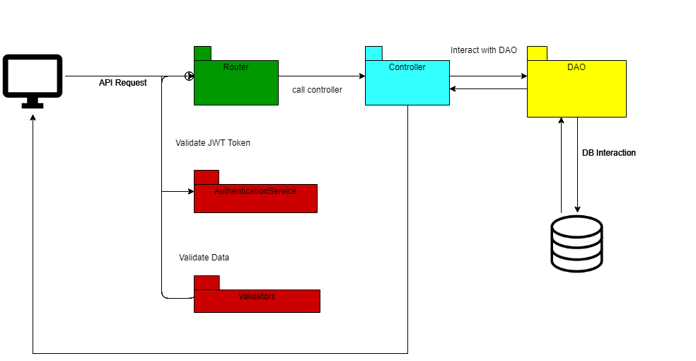

# Bambank

A prototype web application that allows users to trade in Bambeuros.

## Requirements

The web application was required to:

- Allow a user to register an account
- Allow a user to login to their account
- Give a user 100 Bambeuros when they register
- Allow a user to transfer funds to another user
- Allow a user to view their transactions

## Assumptions

The following assumptions were made

- If a user doesn't have enough of a balance to cover a transaction, this transaction would be prevented.
- The only way for a user to currently get funds, is if someone else transfers them Bambeuros.

## Running locally

If you wish to run this application locally, you need to provide firebase database details as environment variables.
The Firebase Console can be found [here](https://console.firebase.google.com/)

You can then add those values to a .env file in the following manner

```env
  API_KEY=
  AUTH_DOMAIN=
  DATABASE_URL=
  PROJECT_ID=
  STORAGE_BUCKET=
  MESSAGE_SENDER_ID=
  SECRET_ID=
```

**NOTE** the SECRET_ID here is simply a secret key that you must set.

Once you have that setup, you should run **npm install** in the root of the directory to get all of the required libraries.

Finally you should be able to use **node index.js** to run the application on http://localhost:8081

## Improvements

As this was a time constrained exercise, there are considerable ways that this project could be improved to follow best practices.

### Testing

Currently there are no tests present for this prototype application. Ideally, this application would have been undertaken in a Test Driven Development manner.
This would provide assurance that the implementation of the requirements was kept simple, and effective, while also providing a clear doucmentation trail of what this application can do.

As this application makes use of firebase, which is an always live database. It could have been useful to create some End to End tests that make use of this, where you can 100% confirm of the action was succesful.

### Application Strucutre

The overall structure of this application could be improved vastly. For instance, the routes are currently also handling both validation and data persistence.

This should be refactored to make use of the strong support for middleware that express has. For instance, you could have an _authenticationValidator_ middleware that would handle the validation of login and register requests.
All Firebase interactions could be abstracted out into a DAO type layer.

For example:


#### Sessions vs JWT

This application currently makes use of the express session middleware, which means it cannot act as a stateless application. One could certainly look into using JWT instead, once again leveraing the use of middleware and creating an _authorizationHandler_ that would be used on protected routes.

#### Database

Currently this application uses Firebase, which provides a lot of positives, such as out of the box Authentication support & a Realtime database. It is however a NoSQl database. One could argue that the data being handled here is more inline with a typical Relational Database schema. However, overall, for the interest of time saving & the ease of access on deployment, firebase was a good choice.

#### Views

This application makes use of EJS to help render data. Front end frameworks like React & Vue are far more popular and more heavily relied on currently. Using such a framework in a Client -> Restful API manner is certainly an option.
